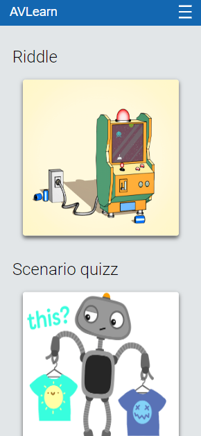
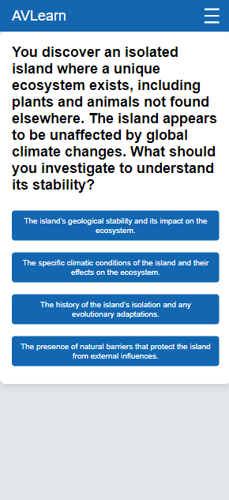
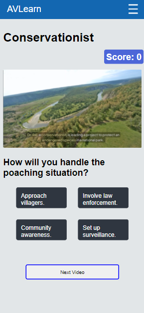

# Gamification of Education

A platform designed to enhance education through gamified learning experiences, built with React, Node.js, Express.js, and MongoDB.

## 🚀 Features

- 🎮 Gamified quizzes and activities
- 🏆 Progress tracking with badges and rewards
- 📊 Leaderboards to boost competition and engagement
- 📱 Responsive design for mobile and desktop

 

## 🛠️ Technologies Used


## 📊 Language & Repo Stats


   
## 📸 Screenshots





## 📦 Installation

To get the project running on your local machine:

```bash
git clone https://github.com/yourusername/educative-game.git
cd educative-game
npm install

# For the client
cd client
npm install
npm run dev

# For the server
cd server
npm init -y
npm i express mongoose
npm run dev

